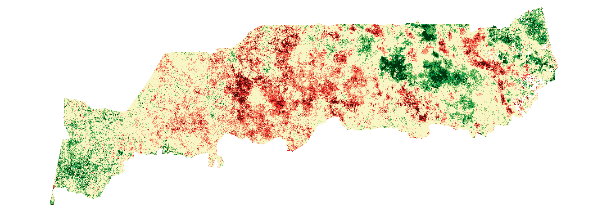
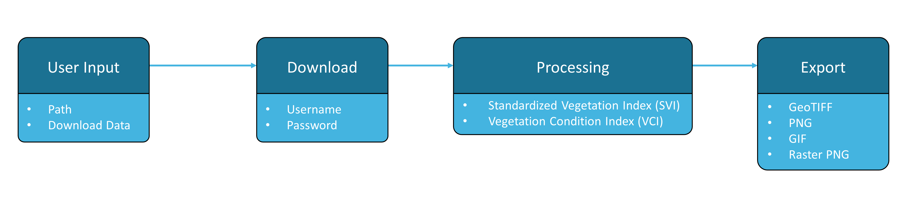

  

# Drought Monitoring

  

***

Spectral vegetation indices are among the most widely used satellite data products for monitoring and measuring vegetation cover, condition, and change. This [Recommended Practice](https://un-spider.org/advisory-support/recommended-practices) applies a multitemporal analysis of the MODIS-based Standardized Vegetation Index (SVI) and Vegetation Condition Index (VCI) to support drought monitoring and early warning.

The [Jupyter Notebook](https://github.com/vhertel/drought-monitoring/blob/master/drought-monitoring.ipynb) covers the full processing chain from data query and download up to the export of the final data products by utilizing open access MODIS data. The tool's workflow follows the UN-SPIDER Recommended Practice on [Drought Monitoring](https://un-spider.org/advisory-support/recommended-practices/recommended-practice-agricultural-drought-monitoring-svi) and is illustrated in the chart below. More detailed information regarding user inputs and processing steps can be found within the Jupyter Notebook.

  

The Jupyter Notebook has been optimized for use with [Binder](https://mybinder.org/). As a cloud computing-based environment for Jupyter Notebooks, it takes advantage of external technical resources and thus allows this tool to be applied using devices with limited computing power, including phones and tablets, and in areas with scarce bandwidth. The notebook can directly be accessed and used by clicking the respective icon below.

***

*This tool was created to support the [UN-SPIDER Knowledge Portal](http://www.un-spider.org/).*   

## Legal notice and disclaimer

<i>"The boundaries and names shown and the designations used on this map do not imply official endorsement or acceptance by the United Nations."</i>
